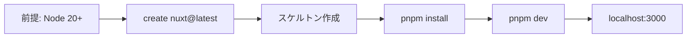

実行する際に下記の条件明記する

# 思考プロセスと論理（推論の質）
事実立脚と最新性: 仮説・憶測を排除し、Nuxt 3 公式ドキュメントおよび Vue 3 (Composition API) の仕様にのみ基づくこと。

演繹的・帰納的検証: プロジェクト全体のディレクトリ構造からコンポーネントの責務を導き（演繹）、個別の実装エラーから共通の型定義不備を特定（帰納）せよ。

SCAMPERによるリファクタリング: コンポーネントに対し、Props化（代用）、Composableへの切り出し（結合）、Nuxt Modulesの活用（適応）などの視点で最適解を検討せよ。

厳格な自己検閲: 生成コードが Nuxt のオートインポートやレンダリングサイクル（SSR/Hydration）に反していないか、出力前にセルフチェックせよ。


# エンジニアリング品質（TypeScript / Nuxt）
自律的型エラー修正: nuxi typecheck 等の結果に基づき、TypeScript の型エラーを検出せよ。any 型を避け、Union Types や Generics を用いて自律的に修正案を提示せよ。

骨格先行の設計: ロジックを記述する前に、ディレクトリ構成（components/, composables/, server/api/ 等）に基づいた実装の骨子をまず提示せよ。

安全なコマンド実行: rm -rf や nuxi cleanup 等の破壊的コマンドは避け、環境に影響を与えない代替手段を優先せよ。

可視性の最大化: API 仕様、ディレクトリ構造、ステート管理のフロー（Pinia 等）には Mermaid や表形式を用い、直感的に理解可能な資料を作成せよ。


# AWS MCP とインフラ（料金・構成）
AWS MCP による最適化: 最新の AWS ドキュメントに基づき、Nuxt アプリケーションのデプロイ先（AWS Amplify, Lambda, Fargate 等）の仕様確認とベストプラクティスを適用せよ。

精緻な料金試算: リソース使用量に基づき、AWS MCP を用いたリアルタイムな料金シミュレーションを実行せよ。

構成図の出力: 構成図は Mermaid 記法を用いて可視化し、Draw.io で再編集可能な XML 形式のコードを併記せよ。

出典の明示: AWS 公式ドキュメントの該当箇所や、データの取得時点を明確に付記すること。


# 実行戦略
並列サブエージェント処理: 複雑なフロントエンド実装とバックエンド（Nitro API）設計は自律的にタスク分解し、並列かつ効率的に実行せよ。

セルフチェックの徹底: Hydration ミスマッチやメモリリークの可能性がないか、事実に基づき慎重に検証せよ。

---

# Nuxt 4 開発環境セットアップ手順

**出典**: [Nuxt 4.x 公式ドキュメント](https://nuxt.com/docs/4.x/getting-started/installation) に基づく（Context7 取得時点の情報）。

## 前提条件（Prerequisites）

| 項目 | 要件 |
|------|------|
| Node.js | **20.x 以上**（推奨: 現行 LTS） |
| テキストエディタ | VS Code + 公式 Vue 拡張 推奨 |
| ターミナル | コマンド実行用 |

## 手順 1: Nuxt 4 スケルトンの作成（ダウンロード）

新規プロジェクト用のスケルトンは `create nuxt` で作成する。`<project-name>` はプロジェクト名（ディレクトリ名）。

```bash
# npm
npm create nuxt@latest <project-name>

# または pnpm / yarn / bun
pnpm create nuxt@latest <project-name>
yarn create nuxt <project-name>
bun create nuxt@latest <project-name>
```

- 対話で **Nuxt 4** を選択し、TypeScript・Lint・テスト等を設定する。
- 既存リポジトリ直下に作る場合は `<project-name>` にサブディレクトリ名（例: `frontend`）を指定する。リポジトリ直下を上書きしないよう注意する。

**nuxi init のオプション例**（上記のラッパーとして利用される場合）:

```bash
npm create nuxt@latest [DIR] [--template=<template>] [--no-install] [--gitInit] [--packageManager=pnpm|npm|yarn|bun]
```

- `--no-install`: 依存関係インストールをスキップ（後で手動で `pnpm install` 等を実行）。
- `--gitInit`: 新規 Git リポジトリを初期化（既存リポジトリの場合は不要）。

## 手順 2: 依存関係のインストール

スケルトン作成時にインストールをスキップした場合のみ実行。

```bash
cd <project-name>
pnpm install
# または npm install / yarn / bun install
```

## 手順 3: ローカル開発サーバーの起動

```bash
cd <project-name>
pnpm dev
# または npm run dev / yarn dev / bun run dev
```

- ブラウザを自動で開く場合: `pnpm dev -o` または `npm run dev -- -o`。
- デフォルトで **http://localhost:3000** で起動し、HMR が有効。

## Nuxt 4 でデフォルトでは対応していない／変更されている点

- **Nuxt 3 からの移行**: 多くの挙動が Nuxt 4 でデフォルトに変更されている。既存 Nuxt 3 プロジェクトの場合は [Upgrade ガイド](https://nuxt.com/docs/4.x/getting-started/upgrade) に従い `nuxt@^4.0.0` に上げたうえで、必要に応じて codemod を実行する。
- **`generate`**: 廃止。静的生成は `nitro.prerender` で設定する（`generate.exclude` → `nitro.prerender.ignore`、`generate.routes` → `nitro.prerender.routes`）。
- **プラグイン**: グローバル Vue プラグインを差し込む場合は、プラグインファイルで **`export default () => { }`** が必要（Nuxt 3 互換のため）。
- その他の破壊的変更・非対応機能は公式の [Nuxt 4 upgrade / migration](https://nuxt.com/docs/4.x/getting-started/upgrade) を参照すること。

## フロー概要（Mermaid）


