# 要件定義書（ご提案）

**プロジェクト名:** マルヤマ商事 タスク管理ツール導入  
**版:** 2.2  
**作成日:** 2026年3月10日  
**位置づけ:** 初回ヒアリング（[議事録（2026年3月10日）](議事録_初回ヒアリング_20260310.md)）を踏まえた**顧客様向けご提案**であり、内容についてはご検討のうえご意見・ご要望をいただければ幸いです。

---

### グランドデザイン（全体概要）

本要件定義の全体像を把握いただくため、段階的導入の流れと技術・インフラ方針を一枚にまとめたグランドデザインを以下に示します。

---

## 1. 概要

### 1.1 目的のご提案

貴社情シス内でご利用いただくタスク管理ツールについて、**個人ごとのタスクの可視化**と**進捗状況の把握**を実現することを目的としてご提案申し上げます。まずは機能を極限まで絞ったミニマムな構成でスタートし、有用性をご確認いただいたうえで、段階的に機能を追加していく形を想定しております。

### 1.2 初回導入スコープのご提案

初回導入時の対象・方針を、下図および下表のとおりご提案いたします。ご検討のうえ、範囲の拡大・縮小などございましたらお申し付けください。

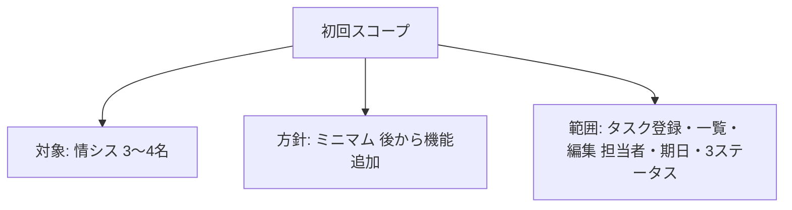

**上図の項目の説明**

| 図の項目 | 内容 |
|----------|------|
| 初回スコープ | 本提案の対象範囲の根幹。以下3要素で構成。 |
| 対象: 情シス 3〜4名 | 情報システム部の3〜4名を初期ユーザーとする。 |
| 方針: ミニマム 後から機能追加 | 機能を絞ってスタートし、有用性確認後に段階的に機能を追加する。 |
| 範囲: タスク登録・一覧・編集 担当者・期日・3ステータス | タスクの登録・一覧・編集、担当者・期日・3ステータス（未対応・対応中・完了）を初版の機能範囲とする。 |

| 項目      | 内容                                             |
| ------- | ---------------------------------------------- |
| 対象部署    | **情報システム部（情シス）**（当初の案では経営企画部を想定していたが、情シス内でのスモールスタートとする） |
| 初期ユーザー数 | **3〜4名**程度の情シスメンバー                             |
| 開発方針    | 機能を極限まで絞った**ミニマム**な構成でスタートし、後から機能を追加           |

---

## 2. 機能要件のご提案

### 2.0 機能一覧とフェーズのご提案

ご判断しやすいよう、想定する機能を**初版でご提供したい機能**と**将来フェーズでご検討いただきたい機能**に分けて整理いたしました。初版の範囲および将来フェーズの優先度については、貴社のご意向に合わせて調整可能です。

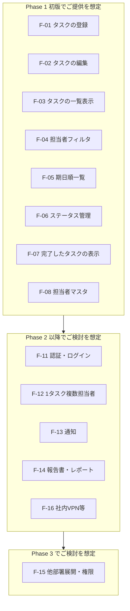

**上図の項目の説明（Phase 1 初版）**

| 図の項目 | 内容 |
|----------|------|
| F-01 タスクの登録 | タイトル・担当者・期日・初期ステータスを入力して登録する。初版でご提供を想定。 |
| F-02 タスクの編集 | 既存タスクのタイトル・担当者・期日・ステータスを変更する。初版でご提供を想定。 |
| F-03 タスクの一覧表示 | タスクを一覧で表示する。初版でご提供を想定。 |
| F-04 担当者フィルタ | プルダウン等で担当者を選び、その担当者のタスクのみ表示する。初版でご提供を想定。 |
| F-05 期日順一覧 | 全ユーザーのタスクを期日順で並べて表示する。初版でご提供を想定。 |
| F-06 ステータス管理 | 未対応・対応中・完了の3段階でステータスを変更する。初版でご提供を想定。 |
| F-07 完了したタスクの表示 | ステータス「完了」のタスクを一覧に残し、振り返り可能にする。初版でご提供を想定。 |
| F-08 担当者マスタ | プルダウン用の担当者一覧（情シス 3〜4名）。初版でご提供を想定。 |

**上図の項目の説明（Phase 2・Phase 3）**

| 図の項目 | 内容 |
|----------|------|
| F-11 認証・ログイン | 利用者認証、ログイン機能。Phase 2（全社展開を見据える頃）でご検討を想定。 |
| F-12 1タスク複数担当者 | 1件のタスクに複数人を担当として登録する。Phase 2 以降でご検討を想定。 |
| F-13 通知 | 期限リマインド、担当変更時の通知等。Phase 2 以降でご検討を想定。 |
| F-14 報告書・レポート | タスク一覧の PDF/Excel 出力、週次レポート等。Phase 2 以降でご検討を想定。 |
| F-16 社内VPN等 | 社内VPN必須、アクセス元制限等。Phase 2（全社展開時）でご検討を想定。 |
| F-15 他部署展開・権限 | 他部署への展開、役職による表示範囲の制御。Phase 3 でご検討を想定。 |
| 矢印 P1→P2→P3 | フェーズは初版から順に進め、Phase 2 を経て Phase 3 へと展開する流れ。 |

### 2.1 基本コンセプトのご提案

**達成したいこと**と**ご提供を想定している仕組み**の対応を、下図にまとめました。

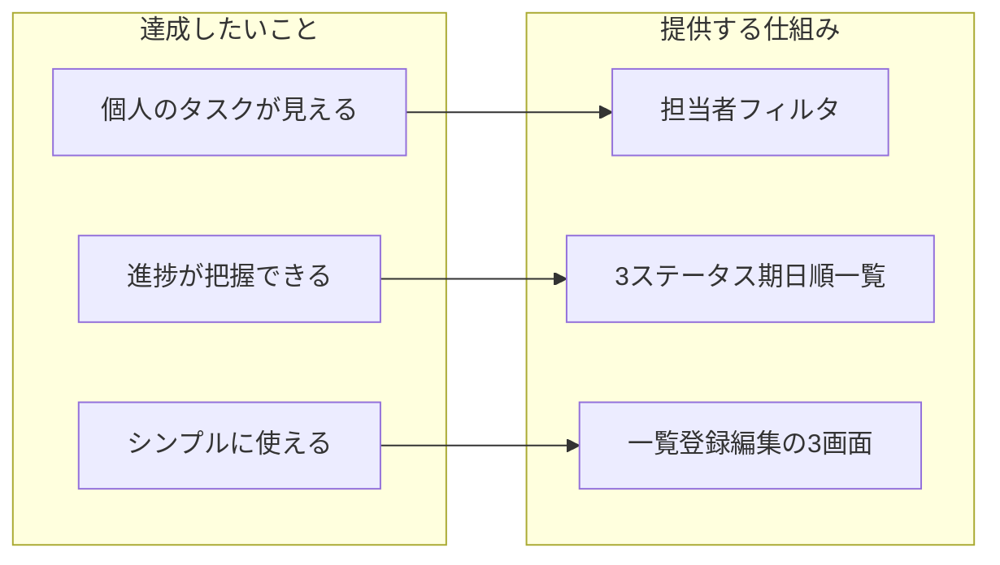

**上図の項目の説明**

| 達成したいこと（左側） | 提供する仕組み（右側） | 対応関係 |
|------------------------|------------------------|----------|
| 個人のタスクが見える | 担当者フィルタ | 担当者で絞り込み、個人ごとのタスクを表示する。 |
| 進捗が把握できる | 3ステータス期日順一覧 | 未対応・対応中・完了の3段階と期日順一覧で進捗を把握する。 |
| シンプルに使える | 一覧登録編集の3画面 | 一覧・登録・編集の3画面に限定し、操作をシンプルにする。 |

### 2.2 タスク管理のご提案

タスクの**進み具合（ステータス）**と**画面の種類**を、下図に示します。

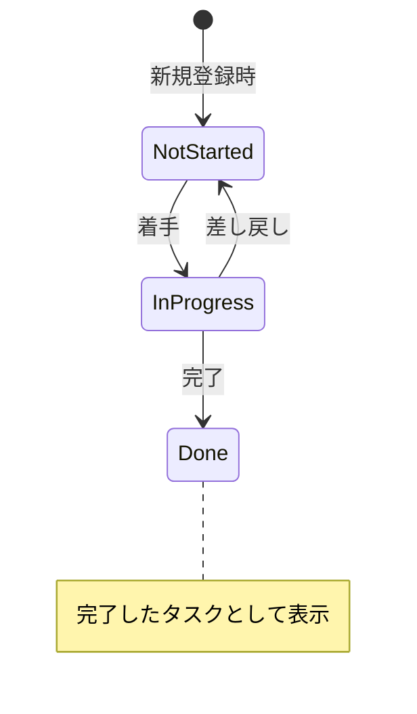

**上図の項目の説明（状態）**

| 図の状態 | 画面上の表示 | 説明 |
|----------|--------------|------|
| NotStarted | **未対応** | 新規登録時の初期状態。まだ手を付けていない。 |
| InProgress | **対応中** | 着手した状態。差し戻すと「未対応」に戻る。 |
| Done | **完了** | 終了した状態。一覧では「完了したタスク」として表示し、削除しない。 |

**上図の項目の説明（遷移）**

| 遷移 | 図のラベル | 説明 |
|------|------------|------|
| [*] → NotStarted | 新規登録時 | タスクを新規登録した時点で「未対応」となる。 |
| NotStarted → InProgress | 着手 | 作業に着手すると「対応中」に変わる。 |
| InProgress → NotStarted | 差し戻し | 差し戻すと「未対応」に戻る。 |
| InProgress → Done | 完了 | 作業完了により「完了」となり、一覧に完了したタスクとして表示される。 |

**上図の項目の説明（タスク管理の要件）**

| 図の項目 | 内容 |
|----------|------|
| タスクの登録 | タスク（やること）を登録できる。 |
| 担当者1名 | 1タスクあたり担当者は1名。複数担当者は初版では対象外。 |
| 期日 | タスクに期日を設定できる（形式は基本設計で定義）。 |
| ステータス3状態 | 未対応・対応中・完了で管理する。表示は「未対応」「対応中」「完了」。 |

### 2.3 ビュー（表示）のご提案

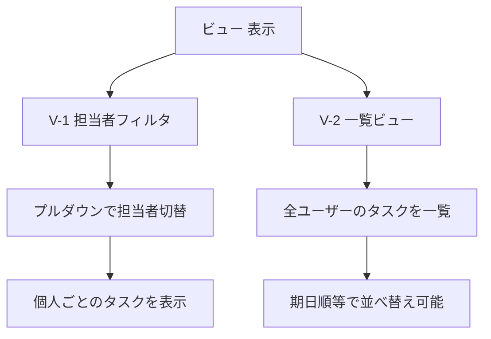

**上図の項目の説明**

| 図の項目 | 内容 |
|----------|------|
| V-1 担当者フィルタ | プルダウン等で担当者を切り替え、個人ごとのタスクを表示する。[2.0](#20-機能一覧とフェーズのご提案) の F-04 に対応。 |
| V-2 一覧ビュー | 全ユーザーのタスクを一覧表示できる。期日順などで並べ替え可能とする。F-03・F-05 に対応。 |
| 画面の種類 | 一覧・登録・編集の3種類。[2.2](#22-タスク管理のご提案) の図のとおり。 |

#### 画面構成（完成図イメージ）

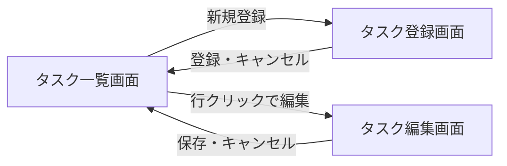

**上図の項目の説明**

| 図の項目 | 内容 |
|----------|------|
| タスク一覧画面 | 担当者フィルタ（プルダウン）、期日順一覧、タスク一覧テーブル、新規登録ボタン、各行の編集・ステータス変更。完了したタスクも表示。 |
| タスク登録画面 | タイトル入力、担当者選択（プルダウン）、期日入力、初期ステータス（未対応）、登録ボタン・キャンセル。 |
| タスク編集画面 | タイトル・担当者・期日・ステータスの編集、保存・キャンセル。ステータスは未対応・対応中・完了の3段階。 |
| 遷移 | 一覧から新規登録でタスク登録画面、行クリックでタスク編集画面。登録・編集からは登録/保存またはキャンセルでタスク一覧画面へ戻る。 |

**タスク一覧画面（担当者フィルタ・期日順一覧）**

**タスク登録画面**

**タスク編集画面**

### 2.4 完了タスクの扱いのご提案

完了したタスクの扱いと、初版ではご提供しないこと（認証など）を下図にまとめました。

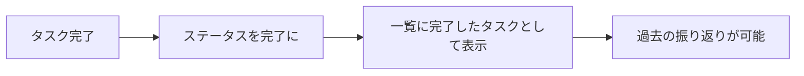

**上図の項目の説明**

| 図のステップ | 内容 |
|--------------|------|
| A タスク完了 | 担当者がタスクを完了として扱う時点。 |
| B ステータスを完了に | システム上でステータスを「完了」に更新する。 |
| C 一覧に完了したタスクとして表示 | 一覧画面で「完了したタスク」として表示され、削除しない。 |
| D 過去の振り返りが可能 | 完了したタスクを残すことで、後から何を実施したかを振り返れる。 |

### 2.5 認証についてのご提案

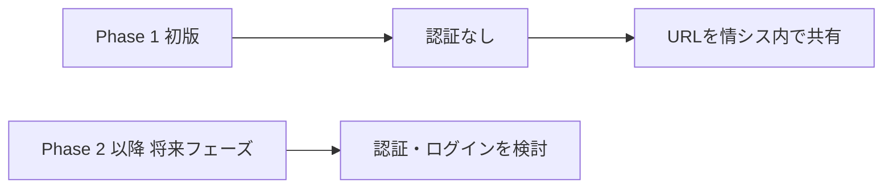

**上図の項目の説明**

| 図の項目 | 内容 |
|----------|------|
| Phase 1 初版 | 本提案の第1版。 |
| 認証なし | 認証（ログイン機能）はご提供しない。利便性とスピードを重視。 |
| URLを情シス内で共有 | 認証なしのため、URL の共有範囲を情シス内に限定する運用。 |
| Phase 2 以降 将来フェーズ | 認証・ログインを Phase 2 以降でご検討いただく想定。[2.4](#24-完了タスクの扱いのご提案) の図も参照。 |

### 2.6 初版ではご提供しない機能のご提案

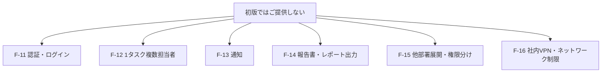

**上図の項目の説明**

| 図の項目 | 内容 |
|----------|------|
| F-11 認証・ログイン | 利用者認証、ログイン機能。Phase 2 以降でご検討を想定。 |
| F-12 1タスク複数担当者 | 1件のタスクに複数人を担当として登録する。Phase 2 以降でご検討を想定。 |
| F-13 通知 | 期限リマインド、担当変更時の通知等。Phase 2 以降でご検討を想定。 |
| F-14 報告書・レポート出力 | タスク一覧の PDF/Excel 出力、週次レポート等。Phase 2 以降でご検討を想定。 |
| F-15 他部署展開・権限分け | 他部署への展開、役職による表示範囲の制御。Phase 3 でご検討を想定。 |
| F-16 社内VPN・ネットワーク制限 | 社内VPN必須、アクセス元制限等。Phase 2（全社展開時）でご検討を想定。 |

一覧の詳細は [2.0 機能一覧とフェーズ](#20-機能一覧とフェーズのご提案) および [2.4 の図](#24-完了タスクの扱いのご提案) を参照。

---

## 3. 非機能要件のご提案

### 3.1 パフォーマンス・可用性

3〜4名のご利用を想定し、同時利用時にも応答・表示に支障のない水準を目標としてご提案しております。応答時間や稼働率など詳細な目標値は、基本設計の段階で必要に応じて定義いたします。

### 3.2 運用コスト

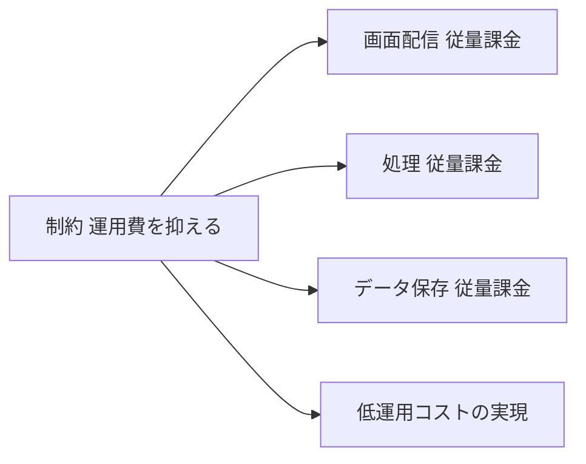

**上図の項目の説明**

| 図の項目 | 内容 |
|----------|------|
| 制約 運用費を抑える | 運用費（月額コスト）を低く抑えることを最優先とする制約。 |
| 画面配信 従量課金 | 画面の保存・配信は利用に応じた課金とし、使った分だけのコストで済む形とする。 |
| 処理 従量課金 | 一覧取得・登録・編集などの処理も利用に応じた課金とし、運用費を抑える。 |
| データ保存 従量課金 | データ保存も利用量に応じた課金とし、運用費を抑える。 |
| 低運用コストの実現 | 上記により、月額の運用費を安く抑えた仕組みを実現する。 |

運用費（月額コスト）を低く抑えることを最優先とし、利用した分だけの課金となる構成により、低運用コストの実現をご提案しております。利用するクラウドや具体的なサービスは基本設計で定義いたします。

### 3.3 拡張性

後から機能を追加しやすい設計とし、将来的な他部署展開・認証追加を見据えた拡張可能な基盤とする形でご提案いたします。

---

## 4. 技術・環境要件のご提案

### 4.1 インフラのご提案

利用者に届く「画面」と「データのやり取り」がどのような流れで動くかを、技術に踏み込まない範囲で整理いたします。**利用するクラウドや具体的なサービス名・構成は、基本設計で定義するものとし、本要件定義では方針のみをご提案します。**

#### システムの流れ（だれが・何をするか）

利用者がブラウザでタスク管理画面を開くと、**画面の表示**と**タスクの登録・一覧などのデータのやり取り**は、それぞれ別の仕組みで行う。下図はその流れを整理したもの。

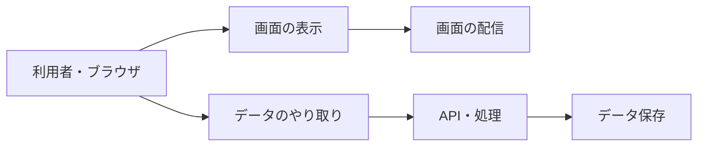

**上図の項目の説明**

| 図の項目 | 役割 |
|----------|------|
| 利用者・ブラウザ | タスク管理画面を利用する起点。 |
| 画面の表示 | 画面のデザインやプログラムを保存し、利用者のブラウザに届ける（ファイルの置き場と配信）。 |
| データのやり取り | 一覧取得・登録・編集などのリクエストを受け付け、必要な処理を行う。 |
| 画面の配信 | 上記「画面の表示」を担う仕組み。具体的なサービスは基本設計で定義する。 |
| API・処理 | 上記「データのやり取り」を担う仕組み。具体的なサービスは基本設計で定義する。 |
| データ保存 | タスクや担当者などのデータを保存する仕組み。具体的なサービスは基本設計で定義する。 |

#### なぜこの方針をご提案しているか

情シス 3〜4 名のタスク管理という規模と、運用費を抑えたいというご要望に合わせ、次のような方針をご提案しております。理由を下図にまとめました。

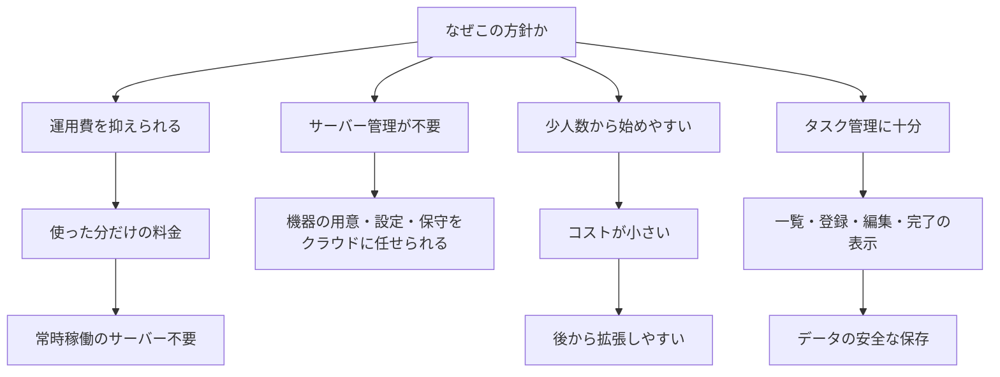

**上図の項目の説明**

| 図の項目 | 内容 |
|----------|------|
| 運用費を抑えられる | 使った分だけの料金で、常時稼働のサーバーを置かなくてよい。 |
| サーバー管理が不要 | 機器の用意・設定・保守をクラウド事業者に任せられ、情シスだけで運用できる。 |
| 少人数から始めやすい | 利用者が少ない時期はコストが小さく、後から利用が増えても拡張しやすい。 |
| タスク管理に十分 | 一覧・登録・編集・完了の表示ができ、データは安全に保存される。 |

#### 技術要件の位置づけ

クラウドの選定、リージョン、アーキテクチャ、利用するサービス、データベースの種類やデータ構造は、**基本設計で定義する**ものとします。本要件定義でおさえる方針は、運用費を抑えること、少人数から始めやすく後から拡張可能であること、および上記の流れ（画面の配信・API・処理・データ保存）を満たすことです。

### 4.2 セキュリティのご提案

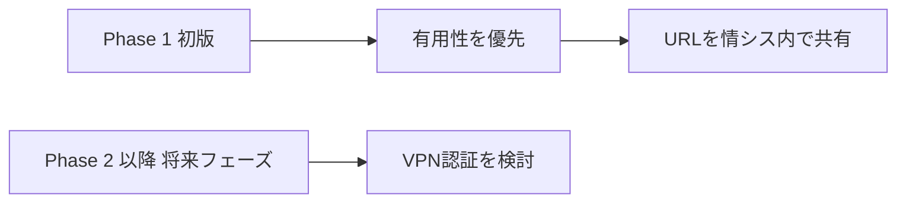

**上図の項目の説明**

| 図の項目 | 内容 |
|----------|------|
| Phase 1 初版 | 本提案の第1版（Phase 1）。 |
| 有用性を優先 | まずシステムの有用性を示すことを優先する。 |
| URLを情シス内で共有 | 認証なしでURLを情シス内で共有する運用とする。 |
| Phase 2 以降 将来フェーズ | 全社展開等を見据えた次のフェーズ。 |
| VPN認証を検討 | 社内VPN・認証等の制限を検討する想定。 |

社内VPN接続等の細かい制限は、全社展開を見据えた次のフェーズでご検討いただく想定です。初版ではシステムの有用性を示すことを優先し、URL の共有範囲を情シス内に限定する運用をご提案しております。

### 4.3 開発・ドキュメント

ドキュメントは GitHub 上で Markdown により管理し、AI 駆動開発を活用して工数削減を図る方針でご提案しております。

---

## 5. 制約・前提条件

### 5.1 プロジェクト制約

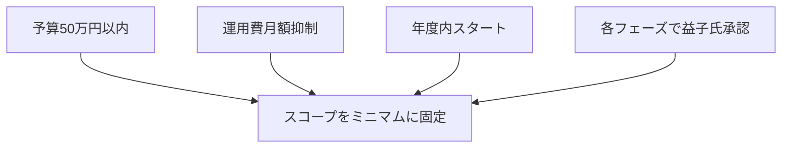

**上図の項目の説明**

| 図の項目 | 内容 |
|----------|------|
| C1 予算50万円以内 | プロジェクト予算の上限。 |
| C2 運用費月額抑制 | 月額運用費を抑える制約。 |
| C3 年度内スタート | 年度内にスタートするスケジュール制約。 |
| C4 各フェーズで益子氏承認 | 各フェーズで研修担当者（益子様）のご承認を得る。 |
| P スコープをミニマムに固定 | 上記制約により、初版スコープをミニマムに固定する。 |

予算・納期・運用費については、プロジェクト憲章および RFP の記載（予算50万円以内、運用費月額抑制、年度内スタート等）に沿って進めてまいります。各フェーズで研修担当者（益子様）のご承認をいただいたうえで次フェーズに進む想定です。

### 5.2 前提条件

初期ユーザーは情シス 3〜4名を想定し、利用範囲は情シス内に限定する前提でご提案しております。認証をご提供しないため、アクセス可能な環境（ネットワーク・URLの共有範囲）は情シス内でご管理いただく前提です。

---

## 6. 用語・ステータス定義

**上図の項目の説明**

| 図の流れ | 内容 |
|----------|------|
| 未対応 | タスクが登録されたが、まだ手を付けていない状態。 |
| → 対応中 | 着手すると「対応中」に遷移する。 |
| 対応中 | タスクに取り組んでいる状態。 |
| → 完了 | 作業完了により「完了」に遷移する。完了したタスクは一覧に残し、削除しない。 |
| 完了 | タスクが終了した状態。一覧では「完了したタスク」として表示する。 |

| 用語  | 定義                                    |
| --- | ------------------------------------- |
| 画面 | 本システムではタスク一覧画面・タスク登録画面・タスク編集画面の3画面で構成する。 |
| 未対応 | タスクが登録されたが、まだ手を付けていない状態。              |
| 対応中 | タスクに取り組んでいる状態。                        |
| 完了  | タスクが終了した状態。一覧では「完了したタスク」として表示し、削除しない。 |

---

## 7. 今後の拡張（スコープ外・将来フェーズ）のご提案

将来フェーズでご検討いただきたい機能の一覧と時期は [2.0 機能一覧とフェーズ](#20-機能一覧とフェーズのご提案) をご参照ください。

| 想定フェーズ | ご検討いただきたい機能（対応表の No.） |
|--------------|----------------------------------------|
| Phase 2 | F-11 認証・ログイン、F-12 1タスク複数担当者、F-13 通知、F-14 報告書・レポート、F-16 社内VPN等 |
| Phase 3 | F-15 他部署展開・権限分け |

認証・ログインおよび権限管理（F-11）、1タスク複数担当者（F-12）、通知（リマインド・担当変更等）（F-13）、報告書・レポート出力（F-14）、他部署展開・権限分け（F-15）、社内VPN・ネットワーク制限（F-16）を、フェーズに応じてご検討いただく想定です。

---

本要件定義書はあくまで**ご提案**であり、貴社のご意見・ご要望をいただけましたら、内容の追加・修正に柔軟に対応いたします。ご検討のほどよろしくお願い申し上げます。

---

## 8. 変更履歴

| 版   | 日付         | 変更内容                                          |
| --- | ---------- | --------------------------------------------- |
| 1.0 | 2026-03-10 | 初版作成（初回ヒアリング議事録に基づく）                          |
| 1.1 | 2026-03-10 | ビュー・インフラに画像を差し込み。他セクションに Mermaid 図を追加し可読性を向上。 |
| 1.2 | 2026-03-10 | 機能の取捨選択を明確化。2.0 に必須機能（F-01〜F-08）・将来フェーズ（F-11〜F-16）を一覧化し、次期フェーズを追記。 |
| 2.0 | 2026-03-11 | 顧客様向けご提案書として全面改訂。断定表現を提案表現に変更、箇条書きを廃止し段落・表で記述。タイトルに「ご提案」を明記。 |
| 2.1 | 2026-03-11 | 非機能・技術要件から具体的サービス名を削除。技術の詳細は基本設計で定義する旨を明記。略称SCRを廃止し画面名で表記。 |
| 2.2 | 2026-03-11 | グランドデザイン（全体概要）を冒頭に追加。版数・表記の統一、誤字修正、運用コストの表現をビジネスメリット重視に変更。 |

---

## 参照

本要件定義書の根拠・関連ドキュメントは次のとおりです。[議事録（2026年3月10日）](議事録_初回ヒアリング_20260310.md)、[プロジェクト憲章](PROJECT_CHARTER.md)、[基本設計書](BASIC_DESIGN.md)、[WBS](WBS.md)。