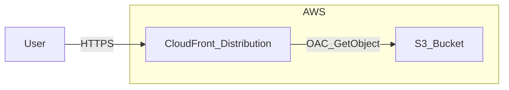

# CloudFront + S3 によるフロント静的配信

タスク管理アプリのフロントエンドを AWS 上で静的サイトとして配信する手順です。**今回のスコープでは S3 と CloudFront のみをデプロイし、DynamoDB はデプロイしません。** 静的サイトのみが CloudFront URL で配信されます（API・DynamoDB は未使用）。

## 構成



- ユーザーは CloudFront の URL にアクセスする。
- CloudFront が S3 オリジンから静的ファイル（Nuxt 静的ビルド）を配信する。
- S3 は OAC（Origin Access Control）で CloudFront からのみ GetObject を許可し、パブリックアクセスはブロックする。

## 前提

- **AWS CLI** の設定が済んでいること（`aws configure` または環境変数 `AWS_ACCESS_KEY_ID` / `AWS_SECRET_ACCESS_KEY` / `AWS_REGION`）。
- **Node.js 20 以上** がインストールされていること。
- 本ドキュメントの手順は **FrontendStack のみ** をデプロイする想定です。DynamoDB は [dynamodb-implementation-and-flow.md](./dynamodb-implementation-and-flow.md) の「今後実装すること」で別途デプロイします。

## 手順

### 1. CDK のビルド

```bash
cd infra
npm install
npm run build
```

- `dist/` にコンパイル結果が出力され、`npx cdk deploy` が利用する `cdk.json` の `app` が `node dist/bin/infra.js` を指しているため、このビルドが必須です。

### 2. 初回のみ: CDK ブートストラップ

未ブートストラップのアカウント・リージョンの場合のみ実行します。

```bash
cd infra
npx cdk bootstrap
```

- プロンプトに従い、必要なら `y` で実行。

### 3. FrontendStack のデプロイ（S3 + CloudFront）

```bash
cd infra
npm run build
npx cdk deploy FrontendStack
```

- 確認プロンプトで `y` を入力。
- デプロイ完了後、出力（Outputs）に **CloudFront URL** と **S3 バケット名** が表示されます。
  - `CloudFrontUrl`: サイトにアクセスする URL（例: `https://xxxxxxxxxxxxx.cloudfront.net`）
  - `S3BucketName`: フロントの静的ファイルをアップロードする先のバケット名

### 4. フロントの静的ビルドを S3 にアップロード

1. **静的ビルドの生成（リポジトリルートで実行）**

   ```bash
   npm run build
   ```

   - Nuxt の `preset: 'static'` により、出力先は **`frontend/.output/public`** です。

2. **S3 へアップロード**

   - デプロイ時の Output で表示された **S3 バケット名** を控えておき、次のいずれかでアップロードします。

   **AWS CLI の場合（推奨）:**

   ```bash
   aws s3 sync frontend/.output/public s3://<S3BucketName>/ --delete
   ```

   - `<S3BucketName>` を実際のバケット名に置き換えてください。
   - `--delete` は、S3 側にのみ存在する古いファイルを削除し、ローカルと揃えます。

   **AWS マネジメントコンソールの場合:**

   - S3 コンソールで対象バケットを開き、`frontend/.output/public` 内のファイル・ディレクトリをドラッグ＆ドロップ（またはアップロード）で配置します。ルートに `index.html` が来るようにしてください。

### 5. 動作確認

- Output の **CloudFront URL** をブラウザで開き、静的サイトが表示されることを確認します。
- 403/404 は `/index.html` にフォールバックするため、SPA のクライアントルーティングも動作します。

## 注意事項

- **DynamoDB は今回デプロイしません。** フロントのみを配信する構成です。本番で API や DynamoDB を使う場合は、[dynamodb-implementation-and-flow.md](./dynamodb-implementation-and-flow.md) の「今後実装すること」に従い、別途 DynamoDBStack のデプロイや API 構成の整備を行ってください。
- FrontendStack のみデプロイすれば、静的サイトは CloudFront の URL で配信できます。
- 初回デプロイ後、フロントのコードを変更した場合は、再度 `npm run build`（ルート）で静的ビルドを生成し、同じ S3 バケットに `aws s3 sync` でアップロードし直してください。
