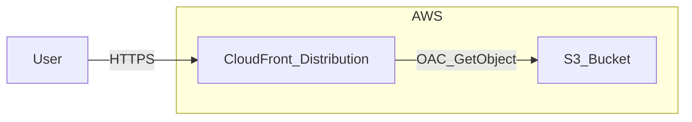
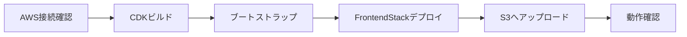

# CloudFront + S3 によるフロント静的配信

タスク管理アプリのフロントエンドを AWS 上で静的サイトとして配信する手順です。**今回のスコープでは S3 と CloudFront のみをデプロイし、DynamoDB はデプロイしません。** 静的サイトのみが CloudFront URL で配信されます（API・DynamoDB は未使用）。

## 構成



- ユーザーは CloudFront の URL にアクセスする。
- CloudFront が S3 オリジンから静的ファイル（Nuxt 静的ビルド）を配信する。
- S3 は OAC（Origin Access Control）で CloudFront からのみ GetObject を許可し、パブリックアクセスはブロックする。

---

## 実装済みの内容

コード・インフラとして既に用意されているものを下表にまとめます。AWS の設定に不慣れな場合は「何がすでにできているか」の目安にしてください。

| 項目 | 説明 | 該当ファイル・リソース |
|------|------|------------------------|
| CDK スタック（FrontendStack） | S3 バケット、CloudFront ディストリビューション、OAC、403/404 → index.html のエラーページ、CloudFrontUrl / S3BucketName の Outputs | [infra/lib/frontend-stack.ts](../infra/lib/frontend-stack.ts) |
| CDK エントリ | FrontendStack の定義と env（アカウント・リージョン。デフォルト `ap-northeast-1`）の指定 | [infra/bin/infra.ts](../infra/bin/infra.ts) |
| インフラのビルド環境 | `npm run build` で `dist/` を生成し、`npx cdk deploy FrontendStack` が実行可能な状態 | [infra/package.json](../infra/package.json)、[infra/tsconfig.json](../infra/tsconfig.json) |
| デプロイ手順ドキュメント | 本ドキュメント。S3 + CloudFront のデプロイとアップロード手順を記載。DynamoDB は別ドキュメント | [dynamodb-implementation-and-flow.md](./dynamodb-implementation-and-flow.md) |

---

## 今後やるべきこと

S3 + CloudFront の静的配信の**外**で、次のステップとして想定している内容です。[dynamodb-implementation-and-flow.md](./dynamodb-implementation-and-flow.md) の「今後実装すること」と整合しています。

| 項目 | 内容 |
|------|------|
| DynamoDB スタックのデプロイ | DynamoDBStack を AWS にデプロイ（`npx cdk deploy DynamoDBStack`）。本番用テーブルの作成。 |
| 本番 API と DynamoDB の連携 | 本番環境でフロントから DynamoDB を利用するための環境変数・IAM・エンドポイント設定。必要に応じて API ゲートウェイや Lambda 等の構成検討。 |
| フロントと本番バックエンドの接続 | 静的サイト（CloudFront + S3）から本番 API を呼び出す構成（CORS・ドメイン・認証等）の整備。 |

次のステップの詳細は [dynamodb-implementation-and-flow.md](./dynamodb-implementation-and-flow.md) を参照してください。

---

## 前提条件

- **AWS CLI** の設定が済んでいること（`aws configure` または環境変数 `AWS_ACCESS_KEY_ID` / `AWS_SECRET_ACCESS_KEY` / `AWS_REGION`）。
- **Node.js 20 以上** がインストールされていること。
- 本ドキュメントの手順は **FrontendStack のみ** をデプロイする想定です。DynamoDB は [dynamodb-implementation-and-flow.md](./dynamodb-implementation-and-flow.md) の「今後実装すること」で別途デプロイします。
- **シークレットの取り扱い:** `.env` や認証情報ファイルは **Git にコミットしないでください**。リポジトリルートの `.gitignore` で `.env` / `.env.*` / `credentials` 等を除外しています。テンプレート用の `.env.example` のみコミット可です。

**用語の補足:** 本ドキュメントで「サンドボックス」とは、開発・検証用の AWS アカウント（または AWS 提供の Sandbox 環境）を指します。本番と区別する場合は、`aws configure` のプロファイル名やアカウント ID で切り替えてください。

---

## AWS CLI の設定方法

認証で作業が止まっている場合は、以下で AWS CLI を設定してください。設定後は「AWS への接続テスト」で接続を確認してからデプロイを進めます。

### 1. AWS CLI のインストール

未導入の場合は先にインストールします。

- **macOS（Homebrew）:** `brew install awscli`
- **Windows:** [AWS CLI インストール（Windows）](https://docs.aws.amazon.com/cli/latest/userguide/getting-started-install.html) を参照
- インストール確認: `aws --version` でバージョンが表示されれば OK

### 2. 認証情報（アクセスキー）の取得

CLI では **アクセスキー ID** と **シークレットアクセスキー** を使って AWS に認証します。取得方法は利用する環境によって異なります。

| 環境 | 取得方法の目安 |
|------|----------------|
| 自分またはチームの AWS アカウント | IAM コンソールで IAM ユーザーを作成し、「セキュリティ認証情報」タブから「アクセスキーを作成」を実行。表示された **アクセスキー ID** と **シークレットアクセスキー** を控える（シークレットは再表示できないため、必ず保存）。 |
| AWS サンドボックス / 研修用環境 | 提供元の案内に従い、発行されたアクセスキーとシークレットを控える。 |
| 組織の本番アカウント | 管理者から発行されたアクセスキー、または IAM ロールの一時認証情報の取得方法の案内を受ける。 |

参考: [IAM ユーザーのアクセスキー作成](https://docs.aws.amazon.com/IAM/latest/UserGuide/id_credentials_access-keys.html)

### 3. `aws configure` で設定する（推奨）

ターミナルで次を実行し、プロンプトに従って入力します。

```bash
aws configure
```

| プロンプト | 入力する内容 |
|------------|--------------|
| AWS Access Key ID | 取得した **アクセスキー ID** |
| AWS Secret Access Key | 取得した **シークレットアクセスキー** |
| Default region name | リージョン（例: `ap-northeast-1`）。本プロジェクトの CDK デフォルトは `ap-northeast-1`。 |
| Default output format | そのまま Enter（`json` のままでよい） |

設定は `~/.aws/credentials` と `~/.aws/config` に保存されます。**シークレットアクセスキーは再表示できないため、入力前に控えておいてください。**

複数アカウント（例: サンドボックスと本番）を使い分ける場合は、プロファイル名を付けて設定します。

```bash
aws configure --profile sandbox
```

利用時は `AWS_PROFILE=sandbox` を設定するか、コマンドに `--profile sandbox` を付けます。

### 4. 環境変数で指定する方法

`aws configure` を使わず、環境変数だけで指定することもできます。

```bash
export AWS_ACCESS_KEY_ID="AKIAxxxxxxxxxxxx"
export AWS_SECRET_ACCESS_KEY="xxxxxxxxxxxxxxxxxxxxxxxxxxxxxxxxxxxxxxxx"
export AWS_REGION="ap-northeast-1"
```

- 本番や CI では環境変数で渡す運用も多いです。
- シークレットをシェル履歴に残さないよう、スクリプトや `.env` から読み込む形にすると安全です。

### 5. 設定後の確認

次のコマンドで、設定した認証で AWS に接続できるか確認します。

```bash
aws sts get-caller-identity
```

`Account`・`UserId`・`Arn` が表示されれば設定は問題ありません。エラーになる場合は「AWS への接続テスト」の失敗時の確認項目を参照してください。

---

## 実際に実装する手順

全体の流れは次のとおりです。



| 手順 | やること | コマンド・操作 | 確認ポイント |
|------|----------|----------------|--------------|
| 0 | AWS への接続確認 | 下記「AWS への接続テスト」を実行 | `Account` / `UserId` / `Arn` が表示されること |
| 1 | CDK のビルド | `cd infra` → `npm install` → `npm run build` | `dist/` が生成され、`npx cdk deploy` が利用可能なこと |
| 2 | 初回のみ: CDK ブートストラップ | `npx cdk bootstrap` | 未ブートストラップのアカウント・リージョンの場合のみ。プロンプトで `y` |
| 3 | FrontendStack のデプロイ | `npm run build` → `npx cdk deploy FrontendStack` | Output に CloudFrontUrl と S3BucketName が表示されること |
| 4 | フロントの静的ビルドを S3 にアップロード | ルートで `npm run build` → `aws s3 sync frontend/.output/public s3://<S3BucketName>/ --delete` | バケット名を Output の値に置き換えること |
| 5 | 動作確認 | CloudFront URL をブラウザで開く | 静的サイトが表示され、SPA ルーティング（403/404 → index.html）が動作すること |

---

## AWS への接続テスト（サンドボックス/本番の確認）

デプロイ前に、**使用する AWS アカウント（サンドボックスまたは本番）に CLI で接続できているか** を確認します。

### 1. 認証情報の確認

現在のプロファイル・リージョン・認証情報の有無を確認します。

```bash
aws configure list
```

- 環境変数で指定する場合は、`AWS_ACCESS_KEY_ID` / `AWS_SECRET_ACCESS_KEY` / `AWS_REGION` が設定されていることを確認してください。
- 複数プロファイルを使う場合は、`AWS_PROFILE=<プロファイル名>` を設定するか、各コマンドに `--profile <プロファイル名>` を付けます。

### 2. 接続テスト（推奨コマンド）

次のコマンドで、その認証情報で AWS に接続できているかをテストします。

```bash
aws sts get-caller-identity
```

プロファイルを指定する場合の例:

```bash
aws sts get-caller-identity --profile your-profile-name
```

**成功時:** 次のような JSON が表示されます。

```json
{
    "UserId": "AIDAXXXXXXXXXX",
    "Account": "123456789012",
    "Arn": "arn:aws:iam::123456789012:user/your-user"
}
```

- `Account`: 接続している AWS アカウント ID（サンドボックスか本番かを識別する目安になります）。
- `Arn`: 現在のユーザーまたはロールの ARN。

**失敗時:** 認証エラーやネットワークエラーが表示されます。次を確認してください。

- 認証情報: `aws configure list` で値が設定されているか、有効期限切れでないか。
- プロファイル: `--profile` または `AWS_PROFILE` が意図したアカウントを指しているか。
- ネットワーク: ファイアウォールやプロキシで AWS エンドポイントがブロックされていないか。

参考: [AWS CLI 設定](https://docs.aws.amazon.com/cli/latest/userguide/cli-configure-files.html)、[GetCallerIdentity](https://docs.aws.amazon.com/STS/latest/APIReference/API_GetCallerIdentity.html)。

### 3. オプション: リージョンと S3 の確認

- **デプロイ先リージョンの確認**

  ```bash
  aws configure get region
  ```

  または環境変数の場合:

  ```bash
  echo $AWS_REGION
  ```

  CDK のデフォルトは `ap-northeast-1` です（[infra/bin/infra.ts](../infra/bin/infra.ts) で `CDK_DEFAULT_REGION` 未設定時に使用）。

- **FrontendStack を既にデプロイ済みの場合:** S3 へのアクセスと権限の簡易チェックとして、バケット一覧が取得できるか確認できます。

  ```bash
  aws s3 ls
  ```

  デプロイしたバケット名が一覧に含まれていれば、接続と S3 権限は問題ない可能性が高いです。

---

## 手順の詳細

### 0. AWS への接続確認（手順表の「0」）

上記「AWS への接続テスト」を実行し、`aws sts get-caller-identity` でアカウント情報が返ることを確認してから次に進んでください。

### 1. CDK のビルド

```bash
cd infra
npm install
npm run build
```

- `dist/` にコンパイル結果が出力され、`npx cdk deploy` が利用する `cdk.json` の `app` が `node dist/bin/infra.js` を指しているため、このビルドが必須です。

### 2. 初回のみ: CDK ブートストラップ

未ブートストラップのアカウント・リージョンの場合のみ実行します。

```bash
cd infra
npx cdk bootstrap
```

- プロンプトに従い、必要なら `y` で実行。

### 3. FrontendStack のデプロイ（S3 + CloudFront）

```bash
cd infra
npm run build
npx cdk deploy FrontendStack
```

- 確認プロンプトで `y` を入力。
- デプロイ完了後、出力（Outputs）に **CloudFront URL** と **S3 バケット名** が表示されます。
  - `CloudFrontUrl`: サイトにアクセスする URL（例: `https://xxxxxxxxxxxxx.cloudfront.net`）
  - `S3BucketName`: フロントの静的ファイルをアップロードする先のバケット名

### 4. フロントの静的ビルドを S3 にアップロード

1. **静的ビルドの生成（リポジトリルートで実行）**

   ```bash
   npm run build
   ```

   - Nuxt の `preset: 'static'` により、出力先は **`frontend/.output/public`** です。

2. **S3 へアップロード**

   - デプロイ時の Output で表示された **S3 バケット名** を控えておき、次のいずれかでアップロードします。

   **AWS CLI の場合（推奨）:**

   ```bash
   aws s3 sync frontend/.output/public s3://<S3BucketName>/ --delete
   ```

   - `<S3BucketName>` を実際のバケット名に置き換えてください。
   - `--delete` は、S3 側にのみ存在する古いファイルを削除し、ローカルと揃えます。

   **AWS マネジメントコンソールの場合:**

   - S3 コンソールで対象バケットを開き、`frontend/.output/public` 内のファイル・ディレクトリをドラッグ＆ドロップ（またはアップロード）で配置します。ルートに `index.html` が来るようにしてください。

### 5. 動作確認（デプロイ後の接続テスト）

- Output の **CloudFront URL** をブラウザで開き、次の点を確認します。
  - 静的サイトのトップページが表示されること。
  - 403/404 は `/index.html` にフォールバックするため、SPA のクライアントルーティング（別パスへの遷移）も動作すること。
- 「接続できているか」の観点では、**同じ CloudFront URL に HTTPS でアクセスして HTML が返る** ことで、CloudFront → S3 の配信経路が動作していると判断できます。

---

## S3 + CloudFront 実装完了の確認

次のチェックリストで、実装が完了しているか確認できます。すべて満たせば完了です。

| # | 確認項目 | 確認方法 | 期待結果 |
|---|----------|----------|----------|
| 1 | FrontendStack がデプロイされている | `cd infra && npx cdk list` で FrontendStack が表示され、デプロイ済みであること | Stack が一覧にあり、デプロイ済み |
| 2 | S3 バケットに静的ファイルが入っている | `aws s3 ls s3://<S3BucketName>/`（Output のバケット名に置き換え） | `index.html` や `_nuxt/` 等が一覧に出る |
| 3 | CloudFront から配信されている | ブラウザで **CloudFront URL**（Output の CloudFrontUrl）を開く | トップページが表示され、SPA のリンクも動作する |
| 4 | HTTPS で HTML が返る | `curl -sI "<CloudFrontUrl>"` で先頭を確認 | `HTTP/2 200` と `content-type: text/html`（または 200 で HTML が返る） |

**補足**

- **403 が出る場合**: S3 に `index.html` が無い、またはアップロード先がバケットルートでない可能性が高い。手順 4 の `aws s3 sync frontend/.output/public s3://<S3BucketName>/ --delete` を実行したか確認する。
- **認証エラー（ExpiredToken 等）**: `aws sts get-caller-identity` で接続を確認し、必要なら `aws configure` やトークンの再取得を行う。その後、手順 4 の sync を実行する。

---

## 注意事項・トラブルシュート

- **DynamoDB は今回デプロイしません。** フロントのみを配信する構成です。本番で API や DynamoDB を使う場合は、[dynamodb-implementation-and-flow.md](./dynamodb-implementation-and-flow.md) の「今後実装すること」に従い、別途 DynamoDBStack のデプロイや API 構成の整備を行ってください。
- FrontendStack のみデプロイすれば、静的サイトは CloudFront の URL で配信できます。
- 初回デプロイ後、フロントのコードを変更した場合は、再度 `npm run build`（ルート）で静的ビルドを生成し、同じ S3 バケットに `aws s3 sync` でアップロードし直してください。

### 接続・権限で問題が起きたとき

| 現象 | 確認すること |
|------|----------------|
| `aws sts get-caller-identity` が失敗する | 認証情報（`aws configure list`）、プロファイル名、ネットワーク・プロキシを確認。IAM ユーザー/ロールに `sts:GetCallerIdentity` が許可されているかも確認。 |
| `npx cdk deploy` で権限エラー | 使用している IAM ユーザー/ロールに、CloudFormation・S3・CloudFront・IAM の作成・更新に必要な権限があるか確認。CDK ブートストラップがそのアカウント・リージョンで完了しているかも確認。 |
| CloudFront URL で 403 / 空ページ | S3 に `index.html` をアップロードしたか、パスがバケットルートになっているか確認。キャッシュの影響の場合は、CloudFront の invalidation やしばらく時間をおいて再アクセス。 |
