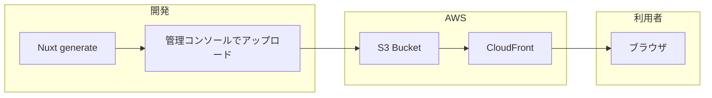

# CloudFront + S3 デプロイ 実装手順

本ドキュメントは、RAG（`RAG/reference.md`）の条件に基づき、フロントエンド（Nuxt 4）を **CloudFront + S3** で配信するための**実装手順**を記載する。

- **スコープ**: 静的サイトの配信インフラ（IaC: CDK）と、管理コンソールからの S3 アップロード手順。**DB の作成は行っていない**（別フェーズで実施する想定）。
- **事実立脚**: AWS CDK 公式ドキュメントおよび Nuxt 4 の静的エクスポート仕様に基づく。
- **可視性**: 表・Mermaid でフローを明示する。

---

## 環境構築の現在の状態

**どこまで終わっているか**を下表に示す。**「未」の項目が、このあとあなたが行うべきアクション**である。

| # | 項目 | 状態 | 説明 |
|---|------|------|------|
| 1 | CDK プロジェクト（infra/） | **済** | `infra/` にスタック定義（S3 + CloudFront）、`package.json`・`cdk.json`・`lib/frontend-stack.ts` 等が存在。`npm install` 済み。 |
| 2 | フロント静的ビルド設定 | **済** | `frontend/nuxt.config.ts` に `nitro.preset: 'static'` を追加済み。 |
| 3 | インフラ依存のインストール | **済** | `infra/` で `npm install` 済み。 |
| 4 | フロントの静的ビルド（成果物の生成） | **要確認** | `frontend/.output/public` が無い場合は手順 5 を実行する。既にある場合は省略可。 |
| 5 | AWS 認証・アカウントの設定 | **未** | ローカルで `aws sts get-caller-identity` が成功する状態にする。 |
| 6 | CDK ブートストラップ | **未** | 対象 AWS アカウントで初回のみ実行。 |
| 7 | スタックのデプロイ（S3・CloudFront の作成） | **未** | `cdk deploy` で AWS にリソースを作成する。 |
| 8 | S3 へのアップロード | **未** | 管理コンソールからビルド成果物を S3 バケットにアップロードする。 |
| 9 | 表示確認（ローカル以外から閲覧） | **未** | CloudFront の URL でブラウザからアクセスして確認する。 |

---

## ここからやるべきアクション

上記の「未」の項目を、**次の順番**で実施する。

1. **AWS 認証の確認**  
   `aws sts get-caller-identity` を実行し、アカウントが解決できることを確認する。失敗する場合は `aws configure` または環境変数（`AWS_PROFILE` / `AWS_ACCESS_KEY_ID` 等）を設定する。

2. **CDK ブートストラップ（初回のみ）**  
   `cd infra && npx cdk bootstrap` を実行する。既にブートストラップ済みの場合はスキップしてよい。

3. **スタックのデプロイ**  
   `cd infra && npx cdk deploy --require-approval never` を実行する。完了後に表示される **CloudFrontUrl** と **S3BucketName** を控える。

4. **フロントのビルド（必要な場合のみ）**  
   `frontend/.output/public` が無い、または作り直したい場合: `cd frontend && npm run generate` を実行する。

5. **S3 へアップロード**  
   AWS マネージメントコンソールで S3 を開き、手順 3 で控えた **S3BucketName** のバケットに、**`frontend/.output/public` の中身**（`index.html` や `_nuxt/` など）をバケットのルートにアップロードする。

6. **表示確認**  
   スマホや別ネットワークの PC から、手順 3 で控えた **CloudFrontUrl**（`https://xxxxx.cloudfront.net`）を開き、トップや `/tasks` が表示されることを確認する。

以降の「前提条件の確認」「手順 1〜7」は、上記アクションの詳細手順である。

---

## 前提条件の確認

| 項目 | 要件 | 確認コマンド |
|------|------|--------------|
| Node.js | 20.x 以上 | `node -v` |
| AWS CLI | 設定済み（プロファイルまたは環境変数） | `aws sts get-caller-identity` |
| CDK | 未導入の場合はインストール | `npx aws-cdk --version` または `npm install -g aws-cdk` |

```bash
node -v
aws sts get-caller-identity   # 認証情報が有効であること
npx aws-cdk --version         # 未インストールなら後述の「CDK のインストール」を実行
```

---

## 実行手順一覧

| 順序 | 手順 | 状態 | コマンド／作業内容 |
|------|------|------|---------------------|
| 1 | CDK のインストール（未導入時） | 要時のみ | `npm install -g aws-cdk` |
| 2 | インフラ依存のインストール | **済** | `cd infra && npm install`（実施済み） |
| 3 | CDK ブートストラップ（初回のみ） | **未** | `cd infra && npx cdk bootstrap` |
| 4 | スタックのデプロイ | **未** | `cd infra && npx cdk deploy --require-approval never` |
| 5 | フロントの静的ビルド | 要確認 | `cd frontend && npm run generate`（`.output/public` が無ければ実行） |
| 6 | S3 へ管理コンソールからアップロード | **未** | ビルド成果物（`.output/public` の中身）を S3 バケットのルートにアップロード |
| 7 | 表示確認 | **未** | CloudFront の URL でブラウザアクセス |

---

## 構成図（Mermaid）



---

## 手順 1: CDK のインストール（未導入時）

ローカルに AWS CDK CLI が入っていない場合のみ実行する。

```bash
npm install -g aws-cdk
cdk --version
```

- グローバルインストールを避けたい場合は、手順 2 の `cd infra && npm install` 後に `npx cdk` で実行可能（本手順書では `npx cdk` を前提とする）。

---

## 手順 2: インフラ依存のインストール

リポジトリルートで実行する。

```bash
cd infra
npm install
```

- `infra/` には CDK アプリ（S3 バケット + CloudFront ディストリビューション）が含まれる。

---

## 手順 3: CDK ブートストラップ（初回のみ）

対象 AWS アカウント・リージョンで初めて CDK を使う場合のみ実行する。

```bash
cd infra
npx cdk bootstrap
```

- 既にブートストラップ済みの場合はスキップしてよい。
- リージョンを指定する場合: `npx cdk bootstrap aws://ACCOUNT_ID/REGION`

---

## 手順 4: スタックのデプロイ

S3 バケットと CloudFront ディストリビューションを作成する。

```bash
cd infra
npx cdk deploy --require-approval never
```

- デプロイ完了後、以下の **Output** が表示される。
  - **CloudFrontUrl**: サイトのアクセス用 URL（`https://xxxxx.cloudfront.net`）
  - **S3BucketName**: ビルド成果物をアップロードする S3 バケット名
- これらの値を控える（手順 6・7 で使用する）。

---

## 手順 5: フロントの静的ビルド

Nuxt 4 を静的サイトとしてビルドし、`.output/public` に出力する。

```bash
cd frontend
npm run generate
```

- 出力先: **`frontend/.output/public`**
- このディレクトリ**の中身**（`index.html`、`_nuxt/` など）を、手順 6 で S3 バケットのルートにアップロードする。

---

## 手順 6: 管理コンソールから S3 へアップロード

1. **AWS マネージメントコンソール**にログインし、**S3** を開く。
2. 手順 4 で控えた **S3BucketName** のバケットを選択する。
3. **アップロード** をクリックする。
4. **`frontend/.output/public`** 内の**すべてのファイルとフォルダ**を、バケットのルート（プレフィックスなし）にアップロードする。
   - 例: `index.html`、`200.html`、`404.html`、`_nuxt/` フォルダごと、など。
5. アップロード完了後、次の手順で CloudFront の URL から表示を確認する。

**注意**:
- バケットのルートに `index.html` が存在すること。
- 更新後にキャッシュを無効化したい場合は、CloudFront コンソールで「 invalidation 」を実行し、パスに `/*` を指定する。

---

## 手順 7: 表示確認

1. 手順 4 で控えた **CloudFrontUrl**（`https://xxxxx.cloudfront.net`）をブラウザで開く。
2. トップページや `/tasks` 等が表示されることを確認する。

---

## ローカル以外からサイトを閲覧できるか確認する手順

「[ここからやるべきアクション](#ここからやるべきアクション)」の 1〜6 を実施すると、インターネット（ローカル以外）からサイトが閲覧できる状態を確認できます。

### 補足

- **スタックのデプロイ**で `Unable to resolve AWS account to use` が出る場合: AWS CLI の設定（`aws configure` または環境変数 `AWS_PROFILE` / `AWS_ACCESS_KEY_ID` 等）を確認してください。
- **S3 アップロード**: アップロードするのは「`frontend/.output/public` フォルダの中身」です。`public` フォルダ自体をアップロードしないでください。バケットのルートに `index.html` がある状態にします。
- **表示確認**: 同じ PC の localhost ではなく、**別デバイスや別ネットワーク**から CloudFront の URL を開くと「ローカル以外から見えている」ことが確認できます。

---

## CDK スタックのリソース一覧

| リソース種別 | 説明 |
|--------------|------|
| S3 バケット | 静的ファイル格納。パブリックアクセスはブロック。CloudFront からのみ OAC でアクセス。 |
| CloudFront ディストリビューション | S3 をオリジンに配信。HTTPS リダイレクト・403/404 時は index.html を返す。 |
| Origin Access Control (OAC) | CloudFront が S3 にアクセスするための認可。 |

---

## 料金・無料枠（AWS Pricing API 参照）

本構成（CloudFront + S3 静的サイト）の料金は従量課金です。**無料枠内に収まれば月額 0 円**、超過分のみ課金されます。

### 無料枠（新規 AWS アカウント 12 ヶ月）

| サービス | 無料枠の内容 |
|----------|--------------|
| **Amazon S3** | ストレージ 5GB、GET 20,000 回/月、PUT 2,000 回/月 等 |
| **Amazon CloudFront** | データ転送アウト 1TB/月、HTTP/HTTPS リクエスト 1,000 万回/月 |

※ 無料枠はアカウント作成から 12 ヶ月間。詳細は [AWS 無料利用枠](https://aws.amazon.com/free/) を参照。

### 従量単価（東京リージョン・日本エッジ、2025–2026 年時点の Price List API 取得値）

| 項目 | 単価 |
|------|------|
| **S3 ストレージ**（General Purpose） | 約 $0.025/GB/月（最初の 50TB まで） |
| **S3 GET 等**（Standard） | 約 $0.0037/10,000 リクエスト |
| **S3 PUT/POST/LIST 等**（Standard） | 約 $0.0047/1,000 リクエスト |
| **CloudFront HTTPS リクエスト**（日本） | 約 $0.012/10,000 リクエスト |
| **CloudFront データ転送アウト**（日本→閲覧者） | 最初 10TB まで約 $0.114/GB（※1TB/月は無料枠で 0 円になる場合あり） |

### 月額の目安（無料枠超過後・少人数利用）

情シス 3〜4 名程度の利用を想定した場合の目安です。

| 項目 | 想定 | 月額目安（USD） |
|------|------|------------------|
| S3 ストレージ | 50MB（0.05GB） | 約 $0.001 |
| S3 リクエスト | 5,000 GET/月 | 約 $0.002 |
| CloudFront リクエスト | 5,000 HTTPS/月 | 約 $0.006 |
| CloudFront 転送 | 500MB/月 | 無料枠内なら $0。超過時は約 $0.06 |
| **合計（無料枠内）** | 上記がすべて無料枠内 | **$0** |
| **合計（無料枠超過後・小規模）** | 上記程度の利用 | **約 $0.01〜0.10/月**（約 1〜15 円） |

※ 日本円は為替で変動します。無料枠を超えると請求が発生します。

---

## 参照・出典

- [AWS CDK - CloudFront Origins (S3BucketOrigin.withOriginAccessControl)](https://docs.aws.amazon.com/cdk/api/v2/docs/aws-cdk-lib.aws_cloudfront_origins-readme.html)
- [Nuxt 4 - Prerendering / Static Export](https://nuxt.com/docs/4.x/getting-started/prerendering)
- 料金: AWS Price List API（AWS Pricing MCP 経由で取得。AmazonS3 / AmazonCloudFront、ap-northeast-1・Japan）
- 本プロジェクト: `RAG/reference.md`、`infra/lib/frontend-stack.ts`
