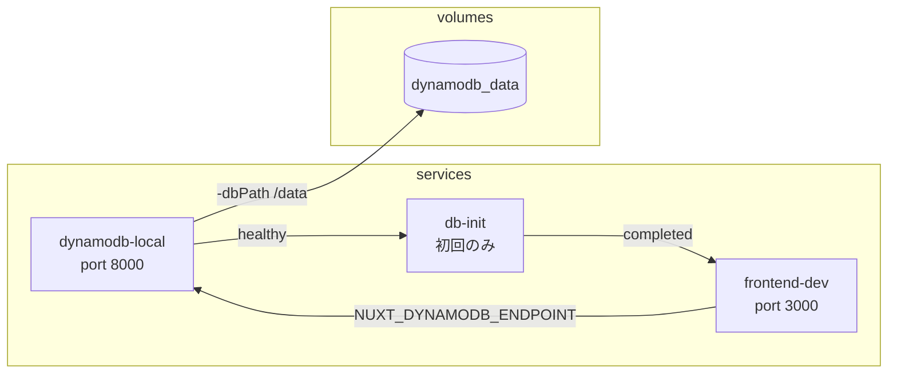
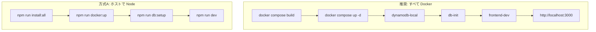

# Docker 設定と開発環境（Windows / Mac 共通）

本ドキュメントに、**Docker まわりの作成した設定の構成**・**実際の作成手順**・**利用手順**を一括でまとめる。Windows と Mac の両方で同じ手順で開発できるようにしている。

---

## 1. 作成した Docker 設定の構成

### 1.1 ファイル一覧

| ファイル | 役割 |
|----------|------|
| **docker-compose.yml**（リポジトリルート） | DB・バックエンド（db-init）・フロントを定義。**docker compose up で環境が一括で整う。** |
| **backend/Dockerfile** | DB 初期化用。テーブル作成・担当者シードを実行して終了するコンテナ。 |
| **backend/.dockerignore** | ビルドコンテキストから node_modules 等を除外。 |
| **frontend/Dockerfile** | フロントの静的ビルド＋ nginx 配信用（本番プレビュー用）。マルチステージビルド。 |
| **frontend/Dockerfile.dev** | 開発用。Node 20 Alpine でソースをマウントし、コンテナ内で `npm run dev` を実行。 |
| **frontend/.dockerignore** | ビルドコンテキストから node_modules / .nuxt / .output 等を除外。 |
| **.gitattributes**（リポジトリルート） | `*.sh` の改行を LF に統一し、Docker 内のシェルが Windows クローンでも動作するようにする。 |
| **package.json**（リポジトリルート） | `docker:up` / `docker:down` / `docker:dev` / `db:setup` 等の npm スクリプトを定義。 |

### 1.2 docker-compose.yml のサービス構成



| サービス | イメージ/ビルド | ポート | 備考 |
|----------|------------------|--------|------|
| **dynamodb-local** | `amazon/dynamodb-local:latest` | 8000 | **データ永続化**: 名前付きボリューム `dynamodb_data` に `-dbPath /data` で保存。Docker 終了後もデータが残り、Windows/Mac/Linux で同じ構成。ヘルスチェック通過後に db-init が実行される。 |
| **db-init** | `backend/Dockerfile` からビルド | — | テーブル作成・担当者シード実行後に終了（restart: no）。テーブルが既に存在する場合はスキップ。frontend-dev はこの完了を待つ。 |
| **frontend-dev** | `frontend/Dockerfile.dev` からビルド | 3000 | `./frontend` をマウント、`frontend_node_modules` ボリュームで node_modules を永続化。 |

### 1.3 ルートの npm スクリプト（Docker 関連）

| スクリプト | 実行内容 |
|------------|----------|
| `npm run docker:up` | `docker compose up -d dynamodb-local`（DynamoDB のみ起動。ホストで `npm run dev` する場合用） |
| `npm run docker:down` | `docker compose down` |
| `npm run docker:logs` | DynamoDB Local のログを表示 |
| `npm run docker:dev` | `docker compose up`（DB ＋ db-init ＋ フロントを一括起動。**これだけで環境が整う**） |

### 1.4 検証済み環境

- **`docker compose build`**: リポジトリルートで実行し、**Mac** にて検証済み（`db-init`・`frontend-dev` イメージが正常にビルドされる）。
- **`docker compose up -d`**: 同一環境で実行し、dynamodb-local → db-init（テーブル作成・シード）→ frontend-dev の順で起動し、http://localhost:3000 および /api/assignees の応答を確認済み。
- **Windows**: 上記と同じ手順でビルド・起動可能な想定。Docker Desktop を利用し、WSL2 バックエンドを推奨。

---

## 2. 設定の作成手順（実施した手順）

以下は、今回の Docker 設定を再現するための手順である。

### 2.1 リポジトリルートの準備

1. **ルートに package.json を用意**  
   - 既存のルート `package.json` に以下を追加した。
   - スクリプト: `docker:up`, `docker:down`, `docker:logs`, `docker:dev`, `db:setup`, `dev`（`cross-env` 使用）など。
   - `devDependencies`: `cross-env`（Windows で環境変数付き `npm run dev` を動かすため）。

2. **install:all でルートもインストール**  
   - `install:all` を `npm install && npm install --prefix frontend && npm install --prefix backend` に変更し、ルートで `cross-env` を入れるようにした。

3. **.gitattributes の追加**  
   - リポジトリルートに `.gitattributes` を作成し、`*.sh text eol=lf` を指定（Docker 内シェルの改行互換のため）。

### 2.2 docker-compose.yml の作成・更新

1. **リポジトリルートに docker-compose.yml を配置**（既存の場合は更新）。
2. **dynamodb-local サービス**  
   - イメージ: `amazon/dynamodb-local:latest`。ポート: `8000:8000`。  
   - コマンド: `-jar DynamoDBLocal.jar -sharedDb -dbPath /data`（**永続化**。`-inMemory` ではなく `-dbPath` で名前付きボリューム `dynamodb_data` に保存）。  
   - ボリューム: `dynamodb_data:/data`。  
   - ヘルスチェック: `curl -s -o /dev/null http://localhost:8000`（応答すれば成功。DynamoDB はルートで 400 を返すため `-f` は使わない）。
3. **db-init サービス**  
   - ビルド: `context: ./backend`, `dockerfile: Dockerfile`。  
   - 環境変数: `DYNAMODB_ENDPOINT=http://dynamodb-local:8000`, `DYNAMODB_TABLE=task-management`。  
   - `depends_on`: `dynamodb-local`（condition: service_healthy）。  
   - `restart: "no"`。テーブル作成とシード実行後に終了し、`frontend-dev` は `service_completed_successfully` を待つ。
4. **frontend-dev サービス**  
   - ビルド: `context: ./frontend`, `dockerfile: Dockerfile.dev`。  
   - 環境変数: `NUXT_DYNAMODB_ENDPOINT=http://dynamodb-local:8000`, `NUXT_HOST=0.0.0.0`。  
   - ボリューム: `./frontend:/app`, `frontend_node_modules:/app/node_modules`。  
   - `depends_on`: `db-init`（condition: service_completed_successfully）。  
   - ポート: `3000:3000`。
5. **ボリューム**  
   - `frontend_node_modules`: フロントの node_modules を永続化。  
   - `dynamodb_data`: **DynamoDB Local のデータ永続化用**。`docker compose down` してもデータは残る。どの OS（Windows/Mac/Linux）でも同じ名前付きボリュームで同じ挙動となる。

### 2.3 バックエンド（DB 初期化）用 Dockerfile の作成

1. **backend/Dockerfile**  
   - `FROM node:20-alpine`。`WORKDIR /app`。  
   - `COPY package.json package-lock.json* ./` → `RUN npm ci --omit=dev`。  
   - `COPY scripts ./scripts`。  
   - `ENTRYPOINT`: `node scripts/create-table.js && node scripts/seed-assignees.js`。  
   - Compose の `db-init` サービスで `DYNAMODB_ENDPOINT=http://dynamodb-local:8000` を渡す。

2. **backend/.dockerignore**  
   - `node_modules`, `.git`, `*.md` を除外。

### 2.4 フロント用 Dockerfile の作成

1. **frontend/Dockerfile**（既存）  
   - 静的ビルド用。Node 20 Alpine でビルドし、nginx で配信。本番プレビュー用。

2. **frontend/Dockerfile.dev**（新規）  
   - `FROM node:20-alpine`。  
   - `WORKDIR /app`。  
   - `COPY package.json package-lock.json* ./` → `RUN npm ci`。  
   - `COPY . .`（ビルド時のみ。実行時は compose で上書きマウント）。  
   - `ENV NUXT_HOST=0.0.0.0`。  
   - `EXPOSE 3000`。  
   - `CMD ["sh", "-c", "npm install && npm run dev"]`。

3. **frontend/.dockerignore**（新規）  
   - `node_modules`, `.nuxt`, `.output`, `.git`, `*.md` を除外。

### 2.5 Nuxt の開発サーバー設定

- **frontend/nuxt.config.ts** の `devServer` に `host: '0.0.0.0'` を追加。  
  - コンテナ外（ホストのブラウザ）から http://localhost:3000 でアクセスできるようにするため。

---

## 3. 利用手順

### 3.1 前提条件

| 項目 | 要件 |
|------|------|
| Docker | Docker Engine 20.10+ または Docker Desktop（Windows / Mac） |
| Docker Compose | v2 以上（`docker compose` が使えること） |
| オプション | Windows では WSL2 利用を推奨（ファイルパフォーマンス・互換性） |

### 3.2 推奨: すべて Docker で一括起動（フロント・バックエンド・DB）

**ホストで Node をインストールせずに、Docker だけで環境が整う。**

1. **ビルド**（初回または Dockerfile 変更後）
   ```bash
   docker compose build
   ```

2. **起動**
   ```bash
   docker compose up -d
   ```
   または `npm run docker:dev`（フォアグラウンドの場合は `docker compose up`）
   - 起動順: dynamodb-local（ヘルスチェック通過）→ db-init（テーブル作成・シード）→ frontend-dev。

3. **ブラウザで確認**  
   - **アプリ**: 必ず **http://localhost:3000** を開く。ログに表示される `http://0.0.0.0:3000` はブラウザでは開けない（0.0.0.0 は接続用アドレスではない）。
   - DynamoDB Local: http://localhost:8000（参照用）。

4. **停止**
   ```bash
   docker compose down
   ```
   - **DynamoDB のデータは名前付きボリューム `dynamodb_data` に保存されているため、停止しても残る。** 再起動時は同じデータが利用可能。テーブルが既に存在する場合は db-init がスキップされ、既存のタスク・担当者データがそのまま使える。

### 3.5 データ永続化と OS 共通

| 項目 | 説明 |
|------|------|
| **永続化** | DynamoDB Local は `-dbPath /data` でコンテナ内の `/data` に書き出し、Docker の名前付きボリューム `dynamodb_data` をマウントしている。`docker compose down` してもボリュームは削除されず、次回 `docker compose up` で同じデータが読み込まれる。 |
| **どの OS でも同じ** | 名前付きボリュームは Docker が管理するため、Windows・Mac・Linux のいずれでも同じ `docker-compose.yml` で同じ挙動となる。ホストのパスに依存しない。 |
| **データを消したい場合** | `docker compose down -v` でボリュームごと削除できる。次回起動時は db-init がテーブル作成・シードを最初から実行する。 |

### 3.3 方式 A: ホストで Node を実行（DynamoDB のみ Docker）

ホストに Node を入れ、フロントだけ手元で動かす場合。

1. **依存関係のインストール**（初回・リポジトリルート）
   ```bash
   npm run install:all
   ```

2. **DynamoDB の起動とテーブル・シード**
   ```bash
   npm run docker:up
   npm run db:setup
   ```

3. **フロント・API の起動**
   ```bash
   npm run dev
   ```
   - ブラウザで http://localhost:3000 を開く。

### 3.4 フロー概要



---

## 4. Windows / Mac の違いと注意

| 項目 | Windows | Mac |
|------|---------|-----|
| ターミナル | PowerShell / cmd / WSL2 | zsh 等 |
| 環境変数 | `cross-env` で `npm run dev` を統一 | 同上 |
| Docker | Docker Desktop で WSL2 バックエンド推奨 | そのまま利用可能 |
| ボリュームマウント | WSL2 利用時はパフォーマンス良好 | 問題なし |

- **破壊的コマンド**: `rm -rf` や `nuxi cleanup` は使わず、DynamoDB のデータを初期化したい場合のみ `docker compose down -v` でボリューム削除を検討する。
- **出典**: Docker Compose 公式 [Compose file specification](https://docs.docker.com/compose/compose-file/) に準拠。

---

## 5. インフラ（CDK）について

本 Compose で起動するのは **ローカル開発用の DB・バックエンド（db-init）・フロント** まで。**AWS へのデプロイ用インフラ（CDK）** は `infra/` で定義されており、`cdk deploy` 等はホストまたは CI 上で AWS 認証情報を付与して実行する想定。Docker 内で CDK を動かす場合は、認証情報のマウントやプロファイルの受け渡しが必要になるため、通常はローカル開発スタックには含めていない。

## 6. 参照ドキュメント

| 用途 | ドキュメント |
|------|----------------|
| DynamoDB テーブル設計・運用 | [dynamodb-implementation-and-flow.md](./dynamodb-implementation-and-flow.md) |
| develop で DynamoDB を使う | [develop-with-dynamodb.md](./develop-with-dynamodb.md) |
| Nuxt 4 セットアップ | [setup-execution.md](./setup-execution.md) |
