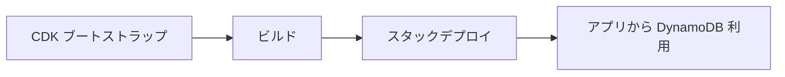

# DynamoDB 実装手順と今後の流れ

実装済みの手順と、ローカル開発・本番デプロイの流れを一括でまとめる。テーブル設計の詳細は [detailed-design-dynamodb.md](./detailed-design-dynamodb.md) を参照。

---

## 今回実装すること（S3・CloudFront）

| 項目 | 内容 |
|------|------|
| CDK ソースの整備 | FrontendStack（S3 + CloudFront）の TypeScript ソース（`infra/lib/frontend-stack.ts`、`infra/bin/infra.ts`）の復元・整備。DynamoDBStack はエントリに残すがデプロイは行わない。 |
| infra のビルド環境 | `infra/package.json`・`infra/tsconfig.json` の整備。`npm install` → `npm run build` で `dist/` を生成し、`npx cdk deploy FrontendStack` を実行可能にする。 |
| デプロイ手順のドキュメント | [cloudfront-s3-deployment.md](./cloudfront-s3-deployment.md) に、CDK ブートストラップ・FrontendStack のデプロイ・フロント静的ビルドの S3 アップロード手順を記載する。 |
| 実際の AWS 構築 | `npx cdk deploy FrontendStack` により S3 バケットと CloudFront ディストリビューションを AWS 上に作成する。静的サイトのみ配信（API・DynamoDB は未使用）。 |

---

## 今後実装すること

| 項目 | 内容 |
|------|------|
| DynamoDB スタックのデプロイ | DynamoDBStack を AWS にデプロイ（`npx cdk deploy DynamoDBStack`）。本番用テーブルの作成。 |
| 本番 API と DynamoDB の連携 | 本番環境でフロントから DynamoDB を利用するための環境変数・IAM・エンドポイント設定。必要に応じて API ゲートウェイや Lambda 等の構成検討。 |
| フロントと本番バックエンドの接続 | 静的サイト（CloudFront + S3）から本番 API を呼び出す構成（CORS・ドメイン・認証等）の整備。 |

---

## 1. 実装した手順（実施済み）

| 順序 | 内容 | 成果物・場所 |
|------|------|----------------|
| 1 | 詳細設計の確定 | `docs/detailed-design-dynamodb.md`（PK/SK/GSI・属性）、`RAG/basic-design.md` への参照追記 |
| 2 | DynamoDB Local の導入 | ホストで Java によりポート 8000 で起動。手順は [local-development.md](./local-development.md) に集約 |
| 3 | ローカル用テーブル作成・シード | `backend/scripts/create-table.js`、`backend/scripts/seed-assignees.js` |
| 4 | Nuxt server API と DynamoDB 接続 | `frontend/server/utils/dynamodb.ts`、`task-mapping.ts`、`server/api/`（assignees, tasks） |
| 5 | IaC（CDK）で本番テーブル定義 | `infra/lib/dynamodb-stack.ts`、`infra/bin/infra.ts` に DynamoDBStack 追加 |

- **ローカル**: テーブル作成は AWS コンソール不要。DynamoDB Local + Node スクリプトで実施。
- **本番**: テーブル作成は IaC のみ。コンソールでの手動テーブル作成は不要。
- **タスクの時刻**: タスクアイテムには任意属性 `dueTime`（文字列・HH:mm）を保存できる。省略時は終日として扱う。DynamoDB はスキーマレスなため、既存テーブルにそのまま利用可能。

---

## 2. 今後の流れ

### 2.1 ローカル開発（日常の流れ）

- **DynamoDB Local の起動・テーブル作成・フロント起動の手順は [local-development.md](./local-development.md) に一括で記載している。** リポジトリルートで、DynamoDB Local をホストで起動したうえで `npm run install:all` → `npm run db:setup` → `npm run dev` で実行する。
- DynamoDB Local のエンドポイント: `http://localhost:8000`（ホストで起動。in-memory で起動した場合はプロセス終了でデータは消える）。
- ローカルでは **AWS 認証情報は不要**。スクリプト・Nuxt API はローカル向けにダミー認証を使用する。

### 2.2 本番（AWS）へのデプロイ



1. **初回のみ: CDK ブートストラップ**
   ```bash
   cd infra
   npm install
   npx cdk bootstrap
   ```
   - AWS CLI の設定（`aws configure` または環境変数）が済んでいること。**手順は [cloudfront-s3-deployment.md](./cloudfront-s3-deployment.md) の「AWS CLI の設定方法」を参照。**

2. **DynamoDB スタックのデプロイ**
   ```bash
   cd infra
   npm run build
   npx cdk deploy DynamoDBStack
   ```
   - 確認プロンプトで `y`。出力にテーブル名・ARN が表示される
   - フロント用スタックもまとめてデプロイする場合: `npx cdk deploy --all`

3. **アプリから本番 DynamoDB を使う場合**
   - 環境変数で **DynamoDB エンドポイントを指定しない**（未設定で AWS デフォルトを使用）
   - 必要に応じて IAM で `dynamodb:*` を付与

### 2.3 トラブル時（ローカル）

- **テーブルを削除して作り直したい場合**（破壊的・ローカルのみ）
  - DynamoDB Local 起動中に実行
  ```bash
  aws dynamodb delete-table --table-name task-management --endpoint-url http://localhost:8000
  ```
  - その後、上記「2.1」のテーブル作成手順で再作成する。

---

## 3. 参照ドキュメント

| 用途 | ドキュメント |
|------|----------------|
| テーブル・GSI・属性の詳細 | [detailed-design-dynamodb.md](./detailed-design-dynamodb.md) |
| ローカル開発の進め方 | [local-development.md](./local-development.md) |
| Nuxt 4 開発環境の構築 | [setup-execution.md](./setup-execution.md) |
| フロント静的配信（CloudFront + S3） | [cloudfront-s3-deployment.md](./cloudfront-s3-deployment.md) |
