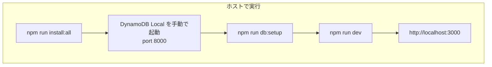

# ローカル開発の進め方

開発は **すべてホスト上** で行う。DynamoDB Local はホストで起動し、フロントは**リポジトリルート**で `npm run dev` を実行する。**infra ディレクトリに移動する必要はない**（infra は AWS 本番デプロイ用 CDK のため）。

---

## 起動手順（実際の操作）

アプリを起動してブラウザで http://localhost:3000 を開くまでの**具体的な手順**。初回と 2 回目以降で共通して使える。

### ステップ 1: 前提の確認・Java のインストール（初回のみ）

| 確認項目 | コマンド・操作 |
|----------|----------------|
| Node.js 20 以上 | `node -v` で確認。未導入なら [Node.js](https://nodejs.org/) をインストール。 |
| Java 17 以上（DynamoDB Local 用） | `java -version` で確認。未導入なら以下でインストール。 |
| **macOS（Java のインストール）** | ターミナルで `brew install openjdk@17` を実行（sudo 不要）。完了後、`/usr/local/opt/openjdk@17/bin/java -version` で確認。 |
| **Windows** | [Adoptium](https://adoptium.net/) などで JDK 17 以上をインストールし、`java` がパスから実行できるようにする。 |

### ステップ 2: 依存関係のインストール（初回のみ）

リポジトリのルートで実行する。

```bash
cd /path/to/task-management-app   # プロジェクトのルートに移動
npm run install:all
```

### ステップ 3: DynamoDB Local の JAR があるか確認（初回のみ）

`backend/.dynamodb-local/DynamoDBLocal.jar` が無い場合は、以下で取得する。

```bash
mkdir -p backend/.dynamodb-local && cd backend/.dynamodb-local
curl -sL -o dynamodb_local_latest.tar.gz "https://d1ni2b6xgvw0s0.cloudfront.net/v2.x/dynamodb_local_latest.tar.gz"
tar -xzf dynamodb_local_latest.tar.gz
cd ../..
```

### ステップ 4: DynamoDB Local を起動する（ターミナル 1）

**ターミナル 1** を開き、リポジトリルートで以下を実行する。起動したらこのターミナルは閉じずにそのままにする。

```bash
cd /path/to/task-management-app
npm run dynamodb:start
```

- ポート 8000 で DynamoDB Local が起動する。
- 「Initializing DynamoDB Local...」「Port: 8000」などが表示されれば成功。
- 終了するときはこのターミナルで `Ctrl+C`。

### ステップ 5: テーブル作成とシード（初回のみ、ターミナル 2）

**ターミナル 2** を新規に開き、リポジトリルートで実行する。DynamoDB Local が起動した状態で行う。

```bash
cd /path/to/task-management-app
npm run db:setup
```

- 「Table "task-management" created successfully」「Seed completed.」などと出れば成功。
- 2 回目以降は DynamoDB Local を起動し直していれば、このステップは省略してよい（既にテーブルとデータがあるため）。

### ステップ 6: フロント・API を起動する（ターミナル 2）

同じターミナル 2 のまま、以下を実行する。

```bash
npm run dev
```

- 「Local: http://0.0.0.0:3000/」などと表示されたら起動完了。

### ステップ 7: ブラウザを開く

- **macOS**: ターミナルで `open http://localhost:3000` を実行するか、ブラウザのアドレスバーに **http://localhost:3000** を入力する。
- **Windows**: ブラウザで **http://localhost:3000** を開く。

以上で、ダッシュボードやタスク一覧・新規登録が DynamoDB Local に接続した状態で利用できる。

### 手順の一覧（コピー用）

| 順番 | ターミナル | 実行内容 |
|------|------------|----------|
| 1 | 任意 | （初回のみ）`npm run install:all` |
| 2 | ターミナル 1 | `npm run dynamodb:start` → 起動したらそのまま |
| 3 | ターミナル 2 | （初回のみ）`npm run db:setup` |
| 4 | ターミナル 2 | `npm run dev` |
| 5 | ブラウザ | http://localhost:3000 を開く（macOS なら `open http://localhost:3000`） |

---

## DB に接続できているかの確認

### 確認方法 1: ブラウザで確認（推奨）

1. **http://localhost:3000** を開く。
2. **タスク一覧**（`/tasks`）または **ダッシュボード** を開く。
3. 次のどちらかで判断する。
   - **接続できている**: タスク一覧や担当者ドロップダウンが表示され、500 エラーや「DynamoDB に接続できません」などのメッセージが出ない。
   - **接続できていない**: 500 Server Error、または「DynamoDB Local に接続できません」「テーブルが存在しません」などのメッセージが表示される。

### 確認方法 2: AWS CLI で DynamoDB Local を確認（任意）

DynamoDB Local が起動しているか・テーブルがあるかをコマンドで確認する。

```bash
aws dynamodb list-tables --endpoint-url http://localhost:8000
```

- **接続できている**: `"TableNames": ["task-management"]` のようにテーブル名が返る。
- **DynamoDB Local が止まっている**: `Could not connect to the endpoint URL` などのエラーになる。

### 接続に必要な条件（チェックリスト）

| 条件 | 確認方法 |
|------|----------|
| DynamoDB Local がポート 8000 で起動している | ターミナルで `npm run dynamodb:start` を実行したウィンドウが開いたままであること。または上記 `aws dynamodb list-tables --endpoint-url http://localhost:8000` が成功すること。 |
| テーブルが作成済みである | 初回または Local を起動し直したあとは `npm run db:setup` を実行していること。 |
| フロントを**リポジトリルート**から起動している | `npm run dev` を**プロジェクトルート**で実行していること（`npm run dev --prefix frontend` のみだと `NUXT_DYNAMODB_ENDPOINT` が渡らず DB に接続されない）。 |

---

## 接続するための手順（まとめ）

DB に接続するには、次を**この順で**行う。

1. **ターミナル 1**: リポジトリルートで `npm run dynamodb:start` を実行し、DynamoDB Local を起動したままにする。
2. **ターミナル 2**: リポジトリルートで **初回または Local を起動し直したあと** は `npm run db:setup` を実行する。
3. **ターミナル 2**: 同じターミナルで `npm run dev` を実行する（必ずルートで。`cd frontend` してからではない）。
4. ブラウザで **http://localhost:3000** を開き、タスク一覧などが表示されることを確認する。

フロントだけ先に起動している場合は、上記 1 → 2 を済ませたうえで、**ルートで** `npm run dev` をやり直すと DB に接続される。

---

## 1. 前提条件

| 項目 | 要件 |
|------|------|
| Node.js | 20 以上 |
| Java | DynamoDB Local を動かす場合のみ。**Java 17 以上**が必要。未インストールなら macOS で `brew install --cask temurin` を実行してから DynamoDB Local を起動する。 |
| オプション | Windows では `cross-env` により `npm run dev` が同一動作。 |

---

## 2. 手順（すべてリポジトリルートで実行）

1. **依存関係のインストール**（初回のみ）
   ```bash
   npm run install:all
   ```

2. **DynamoDB Local を起動**（ポート 8000）
   - リポジトリルートで以下を実行（JAR は `backend/.dynamodb-local` に同梱または事前取得済みを想定）:
     ```bash
     npm run dynamodb:start
     ```
   - 別ターミナルで次の手順を実行する。
   - Java が未インストールの場合は上記「前提条件」のとおり Java を入れてから再度実行する。
   - 手動で起動する場合の例（JAR があるディレクトリで）:
     ```bash
     cd backend/.dynamodb-local && java -Djava.library.path=./DynamoDBLocal_lib -jar DynamoDBLocal.jar -sharedDb -inMemory -port 8000
     ```

3. **テーブル作成とシード**（初回のみ。DynamoDB Local 起動後に実行）
   ```bash
   npm run db:setup
   ```
   または個別に: `npm run db:create-table` → `npm run db:seed`

4. **フロント・API の起動**
   ```bash
   npm run dev
   ```
   - ブラウザで **http://localhost:3000** を開く。

---

## 3. フロー概要



---

## 4. ルートの npm スクリプト

| スクリプト | 実行内容 |
|------------|----------|
| `npm run install:all` | ルート・frontend・backend の依存関係を一括インストール |
| `npm run db:create-table` | ローカル用 DynamoDB テーブル作成（localhost:8000 に接続） |
| `npm run db:seed` | 担当者マスタをシード |
| `npm run db:setup` | テーブル作成 ＋ シードを一括実行（**DynamoDB Local は事前に起動すること**） |
| `npm run dev` | フロント＋API を起動（`NUXT_DYNAMODB_ENDPOINT=http://localhost:8000` を付与） |
| `npm run build` | フロントをビルド |
| `npm run preview` | ビルド後のプレビュー起動 |

---

## 5. トラブルシューティング

| 現象 | 対処 |
|------|------|
| タスク一覧で 500 / 「DynamoDB に接続できません」 | 上記「DB に接続できているかの確認」「接続するための手順」を参照。DynamoDB Local をポート 8000 で起動し、`npm run db:setup` 済みか、かつ**リポジトリルート**から `npm run dev` しているか確認する。 |
| テーブルが存在しない | `npm run db:create-table` を実行する。続けて `npm run db:seed` で担当者を投入する。 |
| フロントで本番 AWS に接続してしまう | 必ずリポジトリルートから `npm run dev` で起動する（`npm run dev --prefix frontend` のみだと `NUXT_DYNAMODB_ENDPOINT` が渡らない）。 |

---

## 6. 参照ドキュメント

| 用途 | ドキュメント |
|------|----------------|
| DynamoDB テーブル設計・運用 | [dynamodb-implementation-and-flow.md](./dynamodb-implementation-and-flow.md) |
| develop で DynamoDB を使う | [develop-with-dynamodb.md](./develop-with-dynamodb.md) |
| Nuxt 4 セットアップ | [setup-execution.md](./setup-execution.md) |
