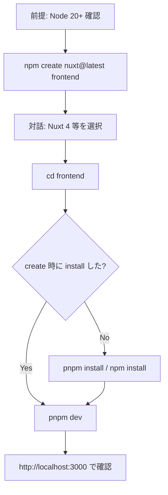

# Nuxt 4 セットアップ 実行手順

本ドキュメントは、RAG（`RAG/reference.md`）の条件に基づき、Nuxt 4 開発環境を構築するための**実行手順**を記載する。

- **事実立脚**: Nuxt 4 公式ドキュメントにのみ基づく。
- **安全なコマンド**: 破壊的コマンド（`rm -rf`, `nuxi cleanup` 等）は使用しない。
- **可視性**: 表・Mermaid でフローを明示する。

---

## 前提条件の確認

| 項目 | 要件 | 確認コマンド |
|------|------|--------------|
| Node.js | 20.x 以上 | `node -v` |
| パッケージマネージャ | npm / pnpm / yarn / bun のいずれか | `npm -v` 等 |

```bash
node -v   # v20.x.x 以上であること
```

---

## 実行手順一覧

| 順序 | 手順 | コマンド／作業内容 |
|------|------|---------------------|
| 1 | スケルトン作成 | `npm create nuxt@latest frontend`（プロジェクト名は任意。既存リポジトリ内ではサブディレクトリ名を指定） |
| 2 | ディレクトリ移動 | `cd frontend` |
| 3 | 依存関係インストール | スキップした場合のみ `pnpm install` または `npm install` |
| 4 | 開発サーバー起動 | `pnpm dev` または `npm run dev` → http://localhost:3000 |

---

## 手順 1: Nuxt 4 スケルトンの作成

**注意**: 既存リポジトリ（例: task-management-app）直下に置く場合は、プロジェクト名に**サブディレクトリ名**（例: `frontend`）を指定し、直下の既存ファイルを上書きしないこと。

### 非対話で実行（推奨・CI/自動化向け）

```bash
# リポジトリルートで実行（minimal = Nuxt 4 推奨テンプレート）
npm create nuxt@latest frontend -- --template minimal --packageManager npm
```

- `--template minimal`: Nuxt 4 用ミニマルセットアップ（対話を省略）
- `--packageManager npm`: 使用するパッケージマネージャを指定
- 既存リポジトリ内では **Git 初期化は行わない**（プロンプトで「No」を選ぶか、後から `frontend/.git` を削除してルートの .git のみにする）

### 対話で実行する場合

```bash
npm create nuxt@latest frontend
```

対話プロンプトでは以下を選択する想定である。

- **テンプレート**: minimal（Nuxt 4 推奨）
- **Nuxt のバージョン**: Nuxt 4 を選択
- **TypeScript**: 推奨（Strict または Yes）
- **Lint / テスト**: 必要に応じて選択
- **Git 初期化**: 既存リポジトリの場合はスキップ（No）

---

## 手順 2: ディレクトリ移動

```bash
cd frontend
```

---

## 手順 3: 依存関係のインストール

`create` 時に依存関係をインストールしていない場合（`--no-install` を付けた場合）のみ実行する。

```bash
pnpm install
# または
npm install
```

---

## 手順 4: ローカル開発サーバーの起動

```bash
pnpm dev
# または
npm run dev
```

- ブラウザを自動で開く: `pnpm dev -o` または `npm run dev -- -o`
- デフォルトで **http://localhost:3000** でアクセス可能（HMR 有効）。ポートは `nuxt.config.ts` の `devServer.port` で固定している。

### ブラウザに何も表示されない場合

- **URL**: 必ず **http://localhost:3000** を開く（別ポートで起動した場合はターミナルに表示される URL を使用）。
- **白い画面**: アニメーション用 CSS の読み込みや実行に失敗するとコンテンツが非表示になる場合がある。本プロジェクトでは `animation-fill-mode: both` により、CSS 未読込時もコンテンツが表示されるようにしている。

---

## 実行フロー（Mermaid）



---

## Nuxt 4 でデフォルト非対応・変更事項（参照）

詳細は `RAG/reference.md` の「Nuxt 4 でデフォルトでは対応していない／変更されている点」を参照すること。

| 項目 | 内容 |
|------|------|
| `generate` | 廃止。静的生成は `nitro.prerender` で設定する。 |
| プラグイン | グローバル Vue プラグインには `export default () => { }` が必要。 |
| Nuxt 3 からの移行 | [Upgrade ガイド](https://nuxt.com/docs/4.x/getting-started/upgrade) に従う。 |

---

---

## 本リポジトリでの実行結果（参考）

| 項目 | 内容 |
|------|------|
| プロジェクト配置 | `frontend/`（リポジトリ直下のサブディレクトリ） |
| テンプレート | minimal（Nuxt 4） |
| 依存関係 | `npm install` 済み（`frontend/node_modules`） |
| 開発サーバー | `cd frontend && npm run dev` → http://localhost:3000 |

**補足**: 開発サーバー起動時に `EMFILE: too many open files` が出る場合は、環境のファイルディスクリプタ上限（macOS の `ulimit -n` 等）の影響です。インストール自体は完了している。

---

**出典**: [Nuxt 4.x Getting Started - Installation](https://nuxt.com/docs/4.x/getting-started/installation)  
**参照**: 本プロジェクト `RAG/reference.md`
